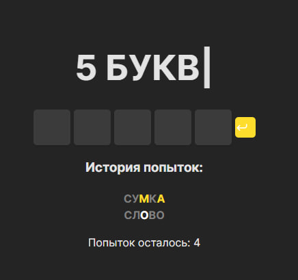

<div><h1>5 БУКВ</h1></div>


Что-то похожее на [**Wordle**](https://wordlegame.org/) и [**5 БУКВ**](https://5bukv.tinkoff.ru/) *(Тинькофф)*


# Правила



- Серая буква - ее **нет** в слове
- Белая буква - **не на своем** месте
- Желтая буква - на **правильном** месте

Чтобы угадать слово есть **6 попыток**.


## Удачи!

<hr>

# Локальный запуск
1. Клонирование репозитория
```bash
git clone https://github.com/Trum-ok/5letters-web.git
cd 5letters-web
```

```bash
docker-compose up --build --force-recreate
```