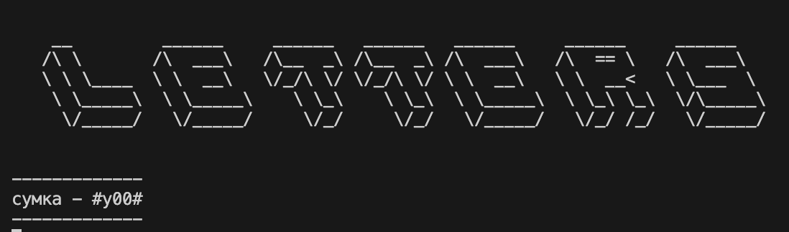

# 5letters
Simple Wordle copy with russian words list

# Usage

```sh
python3 app.py
```
Enter a five-letter word and see the results:


0 - that letter is not in the word  
\# - this letter is out of position   
letter - this letter is in position

You have six tries. 

## Good luck!